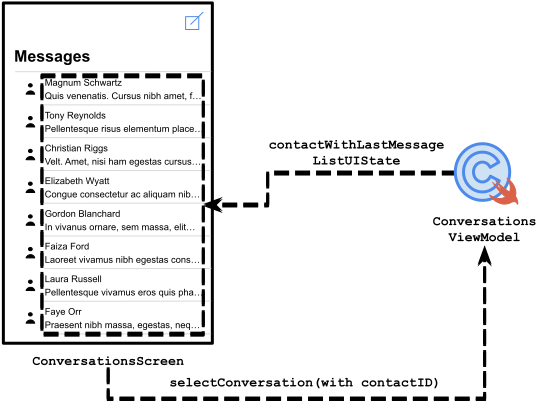

# Contents

- [Kotlin](#kotlin)
  - [Diagram Elements](#diagram-elements)
  - [Method Calling](#method-calling)
  - [Screen/ViewModel Relationship](#screenviewmodel-relationship)
  - [Implementation](#implementation)
  - [Aggregation](#aggregation)
  - [Composition](#composition)
  - [Aggregation With List](#aggregation-with-list)
  - [Composition With Mutable Map](#composition-with-mutable-map)
  - [Composition With Pair of Set](#Composition-with-pair-of-set)
- [Swift](#swift)
  - [Diagram Elements](#diagram-elements-swift)
  - [Method Calling](#method-calling-swift)
  - [Screen/ViewModel Relationship](#screenviewmodel-relationship-swift)
  - [Implementation](#implementation-swift)
  - [Aggregation](#aggregation-swift)
  - [Composition](#composition-swift)
  - [Aggregation With Array](#aggregation-with-array)
  - [Composition With Publisher of Pair](#Composition-with-publisher-of-pair)

# Kotlin
## Diagram Elements
<picture>
  <source media="(prefers-color-scheme: dark)" srcset="./res/kotlin/dark/diagram-elements.dark.svg">
  
</picture>

## Method Calling
<picture>
  <source media="(prefers-color-scheme: dark)" srcset="./res/kotlin/dark/method-calling.dark.svg">
  
</picture>

```kotlin
class AppViewModel(private val repository: AppRepository) : ViewModel { 
  /*...*/ 
    suspend fun addURIs(uris: List<String>) {
        repository.addURIs(uris = uris)
    }
}
```

## Screen/ViewModel Relationship
<picture>
  <source media="(prefers-color-scheme: dark)" srcset="./res/kotlin/dark/screen-viewmodel-relationship.dark.svg">
  
</picture>

```kotlin
// NavGraphBuilderExtension.kt

@Composable
fun NavGraphBuilder.administrativeUnitsScreen(/*..*/) {
  val viewModel = hiltViewModel<AdministrativeUnitsViewModel>()
  val administrativeUnitsUiState by viewModel
    .administrativeUnitsUiStateFlow
    .collectAsState(initial = AdministrativeUnitsUiState.Loading)
  /*...*/

  AdministrativeUnitsScreen(
    /*...*/
    administrativeUnitsUiState = administrativeUnitUiState
    onAdministrativeUnitPressedAt = viewModel::onAdministrativeUnitPressedAt
    /*...*/
  )
}
```

## Implementation
<picture>
  <source media="(prefers-color-scheme: dark)" srcset="./res/kotlin/dark/implementation.dark.svg">
  
</picture>

```kotlin
class MainRepository : HomeRepository { /*...*/ }
```

## Aggregation
<picture>
  <source media="(prefers-color-scheme: dark)" srcset="./res/kotlin/dark/aggregation.dark.svg">
  
</picture>

```kotlin
data class Region(
   private val boundingBox : BoundingBox
)
```

## Composition
<picture>
  <source media="(prefers-color-scheme: dark)" srcset="./res/kotlin/dark/composition.dark.svg">
  
</picture>

```kotlin
data class Address(
   private val administrativeUnit : AdministrativeUnit = CITY
)
```

## Aggregation With List
<picture>
  <source media="(prefers-color-scheme: dark)" srcset="./res/kotlin/dark/aggregation-list.dark.svg">
  
</picture>

```kotlin
data class Region(
   private val holes : List<Polygon>
)
```

## Composition With Mutable Map
<picture>
  <source media="(prefers-color-scheme: dark)" srcset="./res/kotlin/dark/composition-mutable-map.dark.svg">
  
</picture>

```kotlin
class MainRepository {
   private val locationAddress: MutableMap<Address, Location> = /*...*/
}
```

## Composition With Pair of Set
<picture>
  <source media="(prefers-color-scheme: dark)" srcset="./res/kotlin/dark/composition-pair-set.dark.svg">
  
</picture>

```kotlin
class MainRepository {
   private val currentImages: Pair<Address, Set<Image>>? = /*...*/
}
```

# Swift
## Diagram Elements (swift)
<picture>
  <source media="(prefers-color-scheme: dark)" srcset="./res/swift/dark/diagram-elements.dark.svg">
  
</picture>

## Method Calling (swift)

```swift
class ConversationsViewModel: ObservableObject {
    private let conversationsRepository: ConversationsRepository

    /*...*/

    func selectContact(of id: String) {
        /*...*/
        conversationsRepository.selectContact(of: id)
    }
}
```

## Screen/ViewModel Relationship (swift)
<picture>
  <source media="(prefers-color-scheme: dark)" srcset="./res/swift/dark/screen-viewmodel-relationship.dark.svg">
  
</picture>

```swift
struct Navigation {
  @EnvironmentObject var conversationViewModel: ConversationViewModel
  /*...*/

  var body: some View {
    /*...*/
    let conversationsScreen = ConversationsScreen(
        contactWithLastMessageListUIState: $conversationsViewModel
            .contactWithLastMessageListUIState,
        /*...*/
        selectConversationWith: conversationsViewModel.selectConversation(with:),
      )
  }
}
```

## Implementation (swift)
```swift
class MessengerBluetoothDataSource: MessengerDataSource 
```

## Aggregation (swift)
```swift
struct Conversation {
    let contact: Contact
}
```

## Composition (swift)
```swift
struct MessageViewData {
    let id: UUID = UUID()
}
```

## Aggregation With Array
<picture>
  <source media="(prefers-color-scheme: dark)" srcset="./res/swift/dark/aggregation-array.dark.svg">
  
</picture>

```swift
struct Conversation {
    var messages: [Message]
}
```

## Composition With AnyPublisher of Pair
```swift
struct ConversationsRepository {
    var contactWithLastMessageListPublisher: AnyPublisher<[(Contact, Message)], Never> {
      /*...*/
    }
}
```